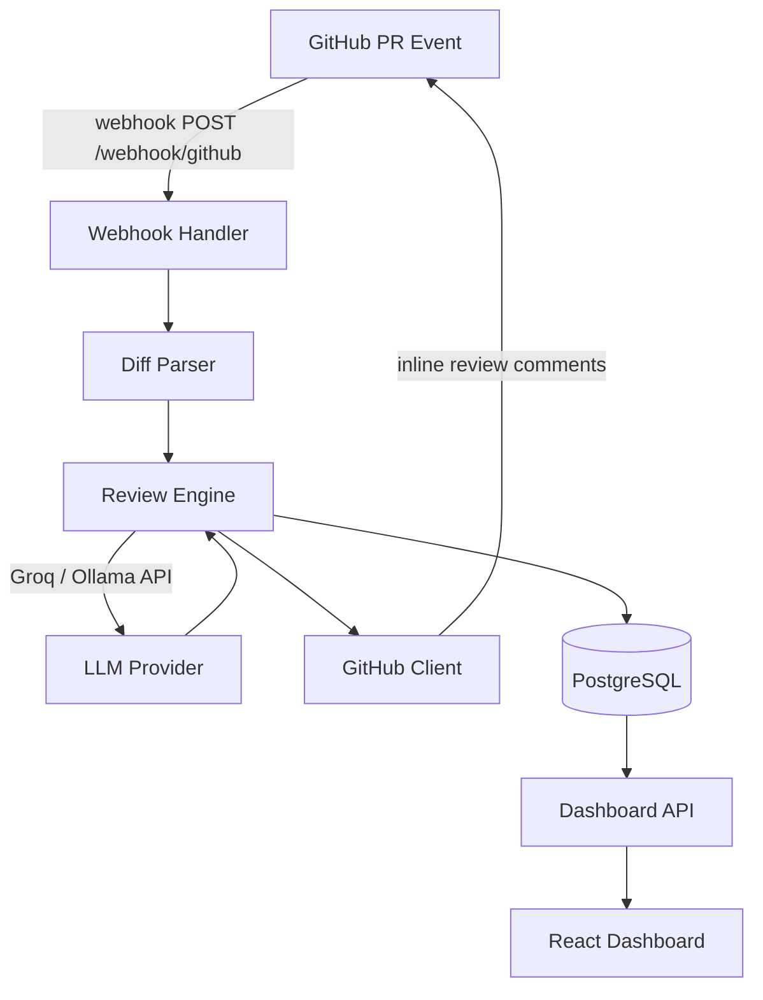
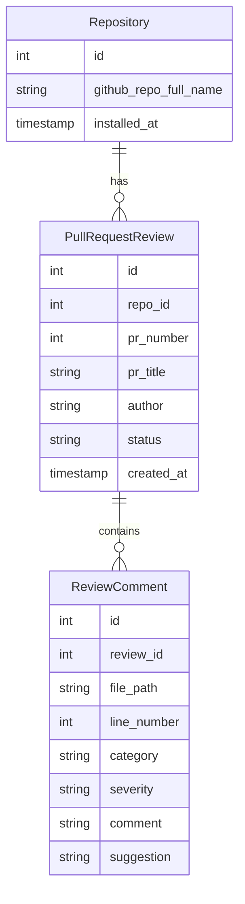

# PR Pilot — AI-Powered Code Review Assistant

Automatically reviews GitHub pull requests using an LLM (Groq or local Ollama) and posts inline review comments directly on the diff. A React dashboard lets you track issues across repositories over time.

---

## Architecture



---

## Database Schema



---

## Project Structure

```
ai-code-reviewer/
├── backend/
│   ├── app/
│   │   ├── main.py                  # FastAPI app entrypoint
│   │   ├── config.py                # Settings via pydantic-settings
│   │   ├── api/
│   │   │   ├── webhooks.py          # POST /webhook/github
│   │   │   └── dashboard.py        # GET /repos, /reviews, /metrics
│   │   ├── core/
│   │   │   ├── diff_parser.py      # Parse unified diff into hunks
│   │   │   ├── review_engine.py    # Orchestrates LLM review
│   │   │   └── llm/
│   │   │       ├── base.py         # Abstract LLMProvider interface
│   │   │       ├── groq_provider.py
│   │   │       └── ollama_provider.py
│   │   ├── github/
│   │   │   ├── client.py           # PyGithub wrapper
│   │   │   └── webhook_validator.py # HMAC signature verification
│   │   └── db/
│   │       ├── models.py           # SQLAlchemy ORM models
│   │       ├── session.py          # Async DB session
│   │       └── migrations/         # Alembic migrations
│   ├── requirements.txt
│   ├── alembic.ini
│   └── Dockerfile
├── frontend/
│   ├── src/
│   │   ├── pages/
│   │   │   ├── Dashboard.tsx       # Metrics overview
│   │   │   ├── RepoDetail.tsx      # Per-repo review history
│   │   │   └── ReviewDetail.tsx    # Individual PR review
│   │   ├── components/
│   │   │   ├── MetricCard.tsx
│   │   │   ├── IssueChart.tsx      # Recharts bar/line charts
│   │   │   └── ReviewTable.tsx
│   │   └── api/client.ts           # Typed API calls
├── docker-compose.yml
├── .env.example
└── README.md
```

---

## Key Implementation Details

### 1. Webhook Handler (`webhooks.py`)
- Validates GitHub **HMAC-SHA256** signature on every request
- Handles `pull_request` events: `opened`, `synchronize`, `reopened`
- Dispatches review job as a background task via FastAPI `BackgroundTasks`

### 2. Diff Parser (`diff_parser.py`)
- Parses GitHub unified diff into structured `DiffHunk` objects
- Extracts file path, line numbers (for inline comment positioning), and changed lines
- Fetches surrounding file context (±20 lines) via GitHub API for richer LLM input

### 3. Review Engine (`review_engine.py`)
- Sends each hunk with context to the LLM using a structured prompt
- Requests JSON output with schema: `{ category, severity, line, comment, suggestion }`
- Posts results as **inline review comments** on the exact diff line via GitHub API

### 4. LLM Provider Abstraction (`llm/base.py`)
- Abstract base class `LLMProvider` with `async def review(prompt) -> ReviewResult`
- **GroqProvider**: uses `groq` SDK, model `llama-3.3-70b-versatile` (free tier)
- **OllamaProvider**: uses `httpx` against local Ollama server, model `codellama`
- Config-driven fallback: if Groq rate-limits, automatically falls back to Ollama

### 5. Dashboard API (`dashboard.py`)
| Endpoint | Description |
|---|---|
| `GET /api/repos` | List tracked repositories |
| `GET /api/repos/{repo}/reviews` | Paginated PR review history |
| `GET /api/repos/{repo}/metrics` | Aggregated counts by category/severity over time |
| `GET /api/reviews/{id}` | Full comment list for a single review |

### 6. React Dashboard
- **Overview page**: total PRs reviewed, issue breakdown by category (donut chart), severity trend over time (line chart)
- **Repo detail page**: table of reviewed PRs with issue counts per PR
- **Review detail page**: list of inline comments with category badges and suggested fixes
- Tailwind CSS for styling, Recharts for all charts

---

## Review Categories & Severities

| Category | Examples |
|---|---|
| `security` | SQL injection, hardcoded secrets, XSS |
| `bug` | Off-by-one errors, null dereferences |
| `performance` | N+1 queries, unnecessary allocations |
| `architecture` | Tight coupling, missing abstractions |
| `style` | Naming, formatting, dead code |

| Severity | Meaning |
|---|---|
| `critical` | Must fix before merging |
| `warning` | Should fix — notable risk or debt |
| `info` | Suggestion / nice-to-have |

---

## Quick Start (Docker Compose)

### 1. Clone and configure

```bash
git clone git@github.com:Prabodh2709/pr-pilot.git
cd pr-pilot/ai-code-reviewer
cp .env.example .env
# Edit .env and fill in your secrets
```

### 2. Start services

```bash
docker compose up --build
```

| Service | URL |
|---|---|
| API | http://localhost:8000 |
| Frontend | http://localhost:5173 |
| Postgres | localhost:5432 |

### 3. Expose the webhook endpoint (local dev)

```bash
ngrok http 8000
```

Add a GitHub webhook to the target repo:
- **Payload URL**: `https://<ngrok-id>.ngrok.io/webhook/github`
- **Content type**: `application/json`
- **Secret**: value of `GITHUB_WEBHOOK_SECRET` from `.env`
- **Events**: select **Pull requests**

---

## Environment Variables

| Variable | Required | Description |
|---|---|---|
| `GITHUB_WEBHOOK_SECRET` | ✅ | HMAC secret shared with GitHub |
| `GITHUB_TOKEN` | ✅ | Personal access token (`repo` scope) |
| `LLM_PROVIDER` | ✅ | `groq` or `ollama` |
| `GROQ_API_KEY` | ✅* | Free at [console.groq.com](https://console.groq.com) |
| `OLLAMA_BASE_URL` | | Default: `http://localhost:11434` |
| `DATABASE_URL` | ✅ | asyncpg connection string |

\* Required when `LLM_PROVIDER=groq`

---

## LLM Providers

### Groq (default, free tier)
- Model: `llama-3.3-70b-versatile`
- Sign up at [console.groq.com](https://console.groq.com) — no credit card required
- Automatically falls back to Ollama on rate-limit

### Ollama (local fallback)
- Model: `codellama`
- Install: https://ollama.com
- Run: `ollama pull codellama`

---

## Local Development (without Docker)

### Backend

```bash
cd backend
python -m venv .venv && source .venv/bin/activate
pip install -r requirements.txt
cp ../.env.example .env
uvicorn app.main:app --reload
```

### Frontend

```bash
cd frontend
npm install
npm run dev
```

### Database migrations (Alembic)

```bash
cd backend
alembic revision --autogenerate -m "initial"
alembic upgrade head
```

---

## Dependencies

**Backend**: `fastapi`, `uvicorn`, `sqlalchemy[asyncio]`, `alembic`, `asyncpg`, `pydantic-settings`, `pygithub`, `groq`, `httpx`, `python-dotenv`

**Frontend**: `react`, `typescript`, `vite`, `tailwindcss`, `recharts`, `react-router-dom`, `axios`
